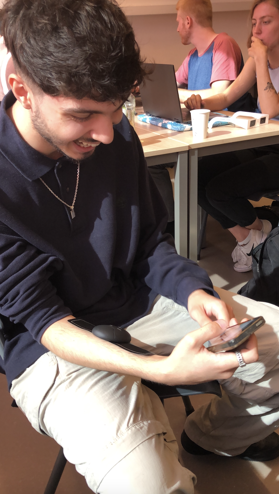
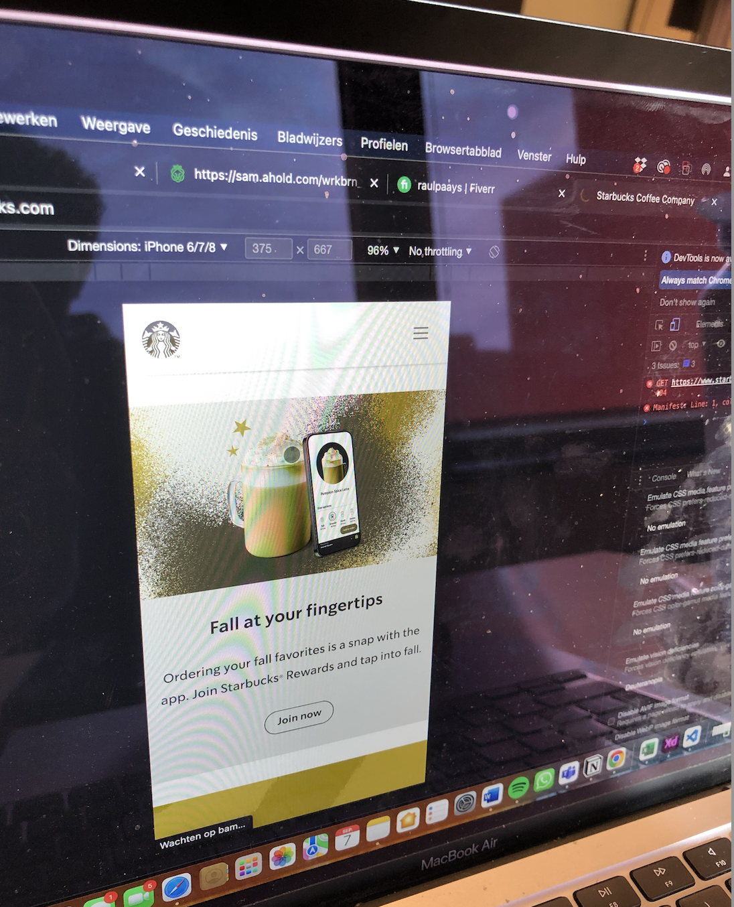
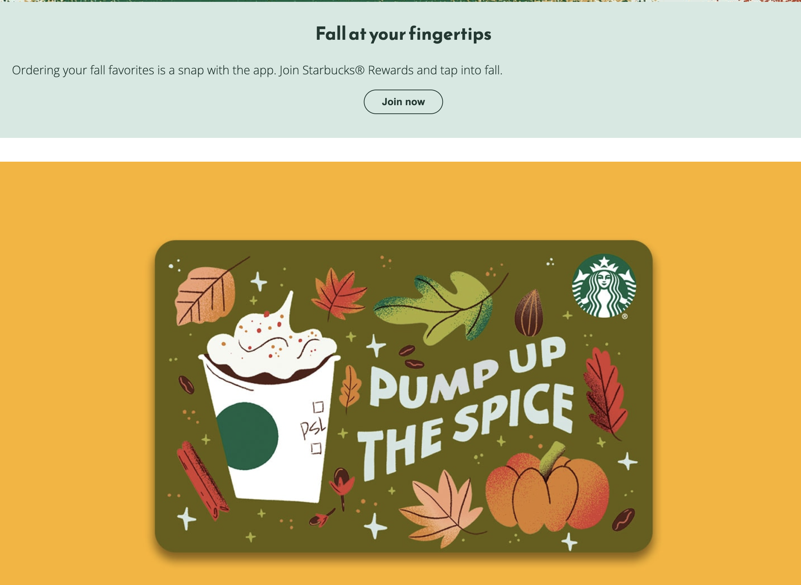

# Procesverslag
Markdown is een simpele manier om HTML te schrijven.  
Markdown cheat cheet: [Hulp bij het schrijven van Markdown](https://github.com/adam-p/markdown-here/wiki/Markdown-Cheatsheet).

Nb. De standaardstructuur en de spartaanse opmaak van de README.md zijn helemaal prima. Het gaat om de inhoud van je procesverslag. Besteedt de tijd voor pracht en praal aan je website.

Nb. Door *open* toe te voegen aan een *details* element kun je deze standaard open zetten. Fijn om dat steeds voor de relevante stuk(ken) te doen.

## Jij

  
uitwerken voor kick-off werkgroep

  ### Auteur:
  Katarina Živanović

  #### Je startniveau:
  Blauw

  #### Je focus:
  Ik vind het lastig om nu een keuze te maken. Het liefst wil ik ze beide in mijn website verwerken. (responsive & surface laag)
 

## Je website

  
uitwerken voor kick-off werkgroep

  ### Je opdracht:
  link naar de website die je gaat namaken óf de naam/omschrijving van je eigen ontwerp:
  https://www.starbucks.com/ 

  #### Screenshot(s) van de eerste pagina (small screen): 
  Home-pagina  
  

  #### Screenshot(s) van de tweede pagina (small screen):
  Menu 
  
 

## Toegankelijkheidstest 1/2 (week 1)

  
uitwerken na test in 1e werkgroep

  ### Bevindingen
  De bevindingen heb ik bij de de verschillende onderdelen gezet.

  #### Screenreader
  Ik had als eerst een screenreader test afgenomen samen met Raul. M.b.v. een screenreader was hij door de Starbucks site gegaan. 

  

  

  Bevindingen:
  -Hij had moeite met swipen naar beneden.
  -Schuifbalk is verstopt, uiteindelijk kwam hij erachter dat je met drie vingers moet swipen.
  -Wordt niet goed aangegeven dat je via de logo naar home kan gaan. 

  Mogelijke oplossing:
  -Schuifbalk duidelijker aangeven. Misschien soort tips toevoegen.

  #### Muis en Toetsenbord 
  Daarna had ik samen met Raul de muis en toetsenbord test gedaan.

  Bevindingen:
  -Deze test was goed te doen op de Starbucks site.
  -Alles was goed te bedienen.
  -Hij had alles snel gevonden.

  Mogelijke oplossingen:
  -Geen, want alles was goed gegaan

  #### Motoriek (shocks, elastiekjes)
  Vervolgens had ik samen met Raul en Bener de ADHD test met een ballon gedaan. 

  

  

  Bevindingen Raul:
  -Kan prima de site besturen met een ballon.
  -Kon zich concentreren.

  Bevindingen Bener:
  -Hij kijkt de heletijd naar de ballon.
  -Kon zich niet zo goed concentreren.

  Mogelijke oplossingen:
  -Misschien gebruik maken van een one action per screen.

  Ik had ook de Spasmes test gedaan. Dit had ik ook samen met Raul en Bener gedaan.

  

   

  Bevindingen Bener:
  -Had het genoemde drankje gevonden.
  -Ookal trilde zijn hand, hij had het drankje (Pink drink) snel gevonden.

  Bevindingen Raul:
  -Kan zijn telefoon niet vasthouden, het valt steeds uit zijn handen.
  -Hij had het drankje (caramel frappucino) snel gevonden. 

  Mogelijke oplossingen:
  -Zou het niet weten. Want ze hadden hun drankje snel gevonden.

  #### Visueel (brillen, contrast, kleurenblind, dark/light). 
  Ten slot had ik een test gehouden met kleurtjes en verschillende soorten brillen. Raul en Bener hadden me hierbij geholpen.

  Bevindingen kleurtjes test Raul (kleurenblind):
  -Ziet er niet aantrekkelijk uit.
  -Het menu zier er bijvoorbeeld niet lekker uit.
  -Home pagina ziet er ook niet echt smakelijk uit. 

  

  

  Mogelijke oplossingen:
  -Andere kleurcontrast gebruiken.
  -Onderzoeken welke kleuren er goed uitzien voor kleurenblinden.

  Bevindingen bril Cataract Raul:
  -Moeilijk zichtbaar.
  -Ziet maar een paar woordjes.

  Mogelijke oplossingen:
  -Grotere woorden gebruiken.
  -Een goed kleurencontrast gebruiken, zodat het beter zichtbaar is.

  Bevindingen bril Central Field Loss Raul:
  -Moet schuin kijken, anders ziet hij het niet.

  

  Bevindingen bril Central Field Loss Bener:
  Home pagina:
  -Kan het prima lezen
  -Handig dat er grotere woorden zijn
  -Witte letters met donkere kleuren maakt het lezen makkelijker.
  -Bij sommige foto's ziet hij niet wat het precies is. Sommige foto's zijn te klein.
  -De onderste balk zag hij niet.

  Menu:
  -Kan de foto's prima zien.
  -Kan ook de tekst zien
  -De onderste balk zag hij niet.

  Mogelijke oplossingen:
  -Grotere afbeeldingen gebruiken.
  -Geen lichte kleuren gebruiken.

## Breakdownschets (week 1)

  
uitwerken na afloop 2e werkgroep

  ### de hele pagina: 
  

  ### dynamisch deel (bijv menu): 
  

  ### wellicht nog een dynamisch deel (bijv filter): 
  

## Voortgang 1 (week 2)

  
uitwerken voor 1e voortgang

  ### Stand van zaken
  In het begin had ik moeite met het maken van de blokjes, ik wist niet hoe je dit moest doen. Tijdens het voortgangsgesprek kwam ik erachter dat je het gewoon met een article kunt doen.

  ### Agenda voor meeting
  samen met je groepje opstellen

  | student 1; Anouk     | student 2; Yeliz   | student 3; Katarina       |
  | ---                  | ---                | ---                       | 
  | -Moet het responsive | -Stukje            | -Hoe maak ik een blokje   |
  |  zijn, naast de surf-| responsiveness     | zonder div te gebruiken?  |
  |  ace plane?          |                    |                           |
  

  ### Verslag van meeting
  hier na afloop snel de uitkomsten van de meeting vastleggen

  - Je hoeft je site niet responsive te maken en een surface plane hebben. Je werkt er maar één uit.
  - Wat uitleg over hoe we wat responsive kunnen maken
  - Een blokje kunnen m.b.v. een article maken. Met een background-color voeg je dan een kleur toe.

## Voortgang 2 (week 3)

  
uitwerken voor 2e voortgang

  ### Stand van zaken
  Ik ben nog niet echt ver gekomen met mijn site, ben nog maar pas bij mijn eerste pagina. Ik heb moeite het maken van een responsive menu.

  ### Agenda voor meeting
  samen met je groepje opstellen

  | student 1; Anouk | student 2; Yeliz      | student 3; Katarina |
  | ---              | ---                   | ---                 |
  | -Hoe kan ik het  | -Gebruik ik de juiste | -Mag je 2 html      |     
  | beste mijn css   | html tags op de       | documenten hebben?  | 
  | gebruiken met de | juiste plek?          | -Hoe kan ik het menu|            
  | 2e pagina?       | -Hoe krijg ik position| icoontje responsive |
  |                  | absolute responsive?  | maken?              |
  |                  |                       | -Hoe kan ik de      |
  |                  |                       | blokjes responsive  |
  |                  |                       | maken?              |

  ### Verslag van meeting
  hier na afloop snel de uitkomsten van de meeting vastleggen

  - Je mag meerdere html documenten hebben.
  - Het icoontje kun je responsive maken met right: 1em; (de 1em kun je natuurlijk zelf aanpassen).
  - De blokjes kun je responsive maken m.b.v. media queries.

## Toegankelijkheidstest 2/2 (week 4)

  
uitwerken na test in 8e werkgroep

  -linkjes toevoegen bij de drankjes en eten, zodat de muis/het toetsenbord het pakt. (dit is me gelukt om te doen)
  -De p's laten voorlezen (dit lukte me niet, omdat ik niet weet hoe het moet)
  -De omschrijving van de knoppen wat uitbreiden (heb ik uiteindelijk niet gedaan, omdat het er dan best wel lelijk uit ziet. En ik zou ook niet weten hoe je het alleen voor de screenreader kan doen)
  -linkjes toevoegen bij de artikels, zodat het te horen is. (dit lukte me niet, omdat ik niet weet hoe het moet)

  ### Bevindingen
  -linkjes toevoegen bij de drankjes en eten, zodat de muis/het toetsenbord het pakt. (dit is me gelukt om te doen)
  -De p's laten voorlezen (dit lukte me niet, omdat ik niet weet hoe het moet)
  -De omschrijving van de knoppen wat uitbreiden (heb ik uiteindelijk niet gedaan, omdat het er dan best wel lelijk uit ziet. En ik zou ook niet weten hoe je het alleen voor de screenreader kan doen)
  -linkjes toevoegen bij de artikels, zodat het te horen is. (dit lukte me niet, omdat ik niet weet hoe het moet)

  #### Screenreader
  -Je hoort bijvoorbeeld dat er linkjes zijn in de nav, maar je hoort niet waar het naartoe leidt. Bijvoorbeeld bij gift card.
  -Je hoort bijvoorbeeld dat het een artikel is, maar niet waar het artikel over gaat.
  -Een omschrijving zetten bij de knoppen, zoals 'learn more about'.

  

  #### Muis en Toetsenbord 
  -Hij pakt de footer niet, omdat het alleen p's zijn.
  -Hij pakt de drankjes en eten niet.
  -Verder is het prima te doen.

  

  #### Visueel (brillen, contrast, kleurenblind, dark/light). 
  Kleurenblind:
  -Blurred versie is nog leesbaar.
  -De rest is ook alles goed leesbaar.

  Bril color #0779p:
  -Alles is prima te zien.

  Bril Combined Loss:
  -Op sommige momenten ziet ze de p wel en sommige momenten niet.
  -Onderste deel van de footer valt weg, de auteursrechten namelijk.

  Bril Hemifield loss:
  -Je ziet alles gewoon.

  

## Voortgang 3 (week 4)

  
uitwerken voor 3e voortgang

  ### Stand van zaken
  In week 4 hheb ik veel kunnen doen. Het is me bijvoirbeeld gelukt om de site responsive te maken (ik had daar wel moeite mee, maar het is toch gelukt). Ik wil nog een paar surface plane punten erin verwerken, dat lijkt me erg leuk. Zoals een Halloween thema switcher. Het lukt me niet om de thema switcher ook op mijn menu pagina toe te passen. 

  ### Agenda voor meeting
  samen met je groepje opstellen

  | student 1; Anouk      | student 2; Yeliz    | student 3; Katarina |
  | ---                   | ---                 | ---                 |
  | -Wat houd toeganke-   | -Waar in de html    | -Hoe krijg ik die   |
  | lijkheid ++ in?       | moet de animatie    | thema switcher knop |
  | -Wat is een praktische| staan?              | helemaal aan het    |
  | manier om je site     | -Moet de form tag   | eind of midden?     |
  | naar github te zetten?| ook gebruikt worden | -Waarom werkt de    |
  |                       | bij een search      | thema switcher niet |
  |                       | input               | op de menu pagina?  |

  ### Verslag van meeting
  hier na afloop snel de uitkomsten van de meeting vastleggen

  - De thema switcher krijg je in het midden door display: flex op de parent te zetten, in dit
  geval is dat de footer.
  - De thema switcher werkt niet op de menu pagina omdat de button niet in een footer hebt
  gezet zoals in de index

## eerste versie vs laatste versie

  ### eerste versie home-pagina:
  Zoals je kunt zien heeft de home pagina geen mooie layout. Alles is veels te groot, zoals de afbeeldingen. Het was ook niet echt responsive. 

  
  
  

  ### eerste versie menu-pagina:
  In de eerste versie van mijn site was ik eigenlijk alleen bezig met de home pagina, dus ik had op dat moment geen menu pagina.

  ### laatste versie home-pagina:
  Nou het is me uiteindelijk gelukt om mijn site responsive te maken! Waar ik natuurlijk erg blij mee ben. Aan het begin van dit blok leek het me erg leuk om zowel als responsiveness als surface plane toe te passen in mijn site. En het is me gelukt om een paar surface plane punten in mijn site te verwerken! 

  De home pagina zonder dat de theme switcher aan is, ziet er zo uit:
  Op mobiel formaat:
  

  Op Ipad formaat:
  

  Op laptop formaat:
  

  De home pagina met de theme switcher aan, ziet er zo uit:
  Op mobiel formaat:
  

  Op Ipad formaat:
  

  Op laptop formaat:
  

  ### laatste versie menu-pagina:
  De menu pagina zonder dat de theme switcher aan is, ziet er zo uit:
  Op mobiel formaat:
  

  Op Ipad formaat:
  

  Op laptop formaat:
  

  De menu pagina met de theme switcher aan, ziet er zo uit:
  Op mobiel formaat:
  

  Op Ipad formaat:
  

  Op laptop formaat:
  

## Eindgesprek (week 5)

  
uitwerken voor eindgesprek

  ### home-pagina:
  De home pagina zonder dat de theme switcher aan is, ziet er zo uit:
  Op mobiel formaat:
  

  Op Ipad formaat:
  

  Op laptop formaat:
  

  De home pagina met de theme switcher aan, ziet er zo uit:
  Op mobiel formaat:
  

  Op Ipad formaat:
  

  Op laptop formaat:
  

  ### menu-pagina:
  De menu pagina zonder dat de theme switcher aan is, ziet er zo uit:
  Op mobiel formaat:
  

  Op Ipad formaat:
  

  Op laptop formaat:
  

  De menu pagina met de theme switcher aan, ziet er zo uit:
  Op mobiel formaat:
  

  Op Ipad formaat:
  

  Op laptop formaat:
  

  ### Dit ging goed/Heb ik geleerd: 
  Ik heb geleerd hoe ik het grid moet toepassen. Ik vind het nog steeds wel een beetje moeilijk om het toe te passen in mijn code, maar ik snap het wel beter! Ik heb bijvoorbeeld het grid toegepast in mijn menu pagina.

  

  ### Dit was lastig/Is niet gelukt:
  Wat me bijvoorbeeld niet is gelukt, is het toegankelijker maken m.b.v. de screenreader. Sommige onderdelen op mijn site pakt de screenreader niet en dit wilde ik verbeteren. Maar het lukte me niet echt. Dus als ik wat meer tijd had zou ik me er wel in verdiepen!

## Bronnenlijst

  
continu bijhouden terwijl je werkt

  Nb. Wees specifiek ('css-tricks' als bron is bijv. niet specifiek genoeg).

  1. https://www.youtube.com/watch?v=At4B7A4GOPg <- hulpmiddel voor de nav. Had me ook geholpen
  bij het responsive maken van de navigatie
  2. Eva Boogaard heeft me geholpen met de thema switcher. Ze heeft uitgelegd hoe ik het kan 
  maken en stylen.
  3. De student assistenten hebben me vooral geholpen als ik vastliep bij bepaalde onderdelen.
  4. Ik kreeg ook hulp van de docent zelf, zoals voor het grid.
  5. https://www.youtube.com/watch?v=1j-XMwrLcg8 <- dit filmpje heeft me geholpen met de 2 verschillende logo's. Dat de originele logo een halloween thema krijgt als je op de theme switcher button klikt.

## Illustraties

  De halloween illustraties/animaties heb ik zelf gemaakt in Procreate:
  
  
  
  
  

