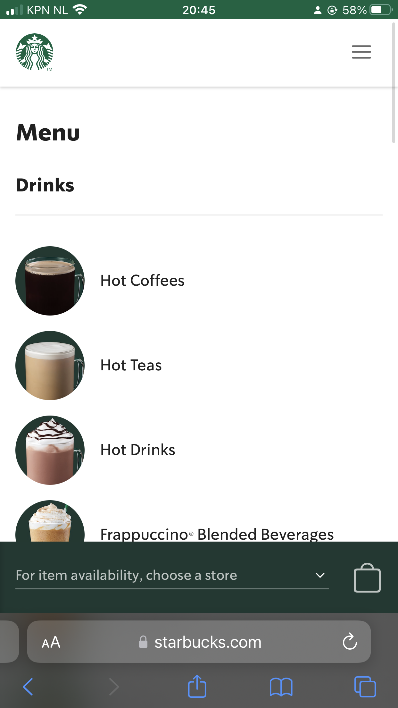
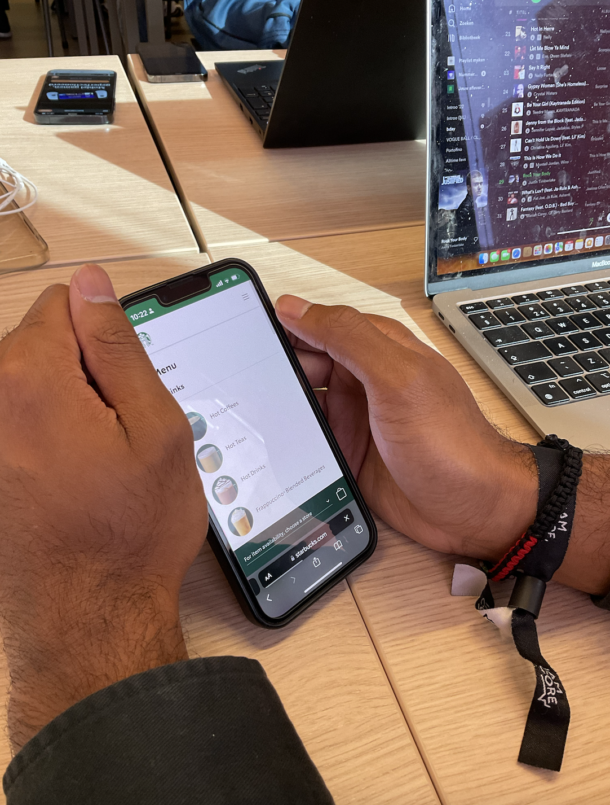
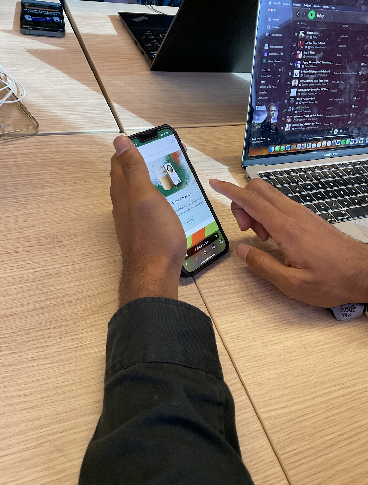
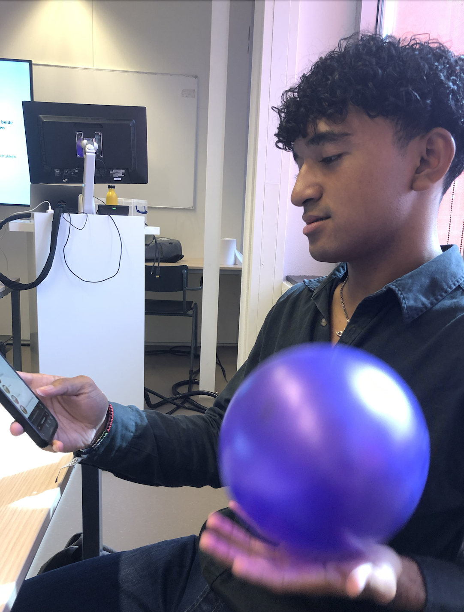
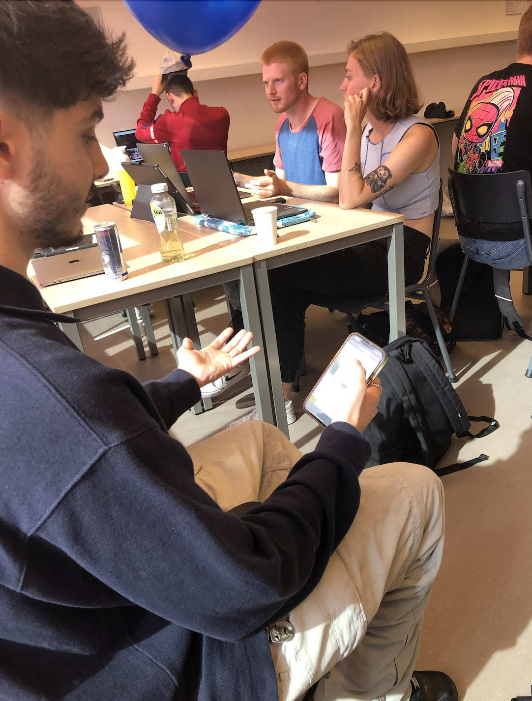
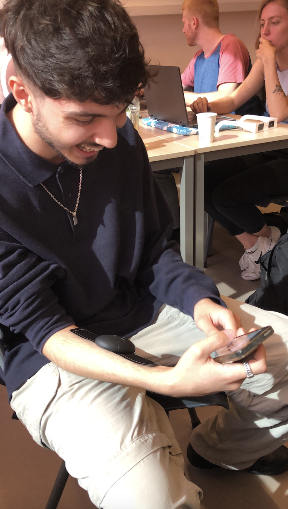
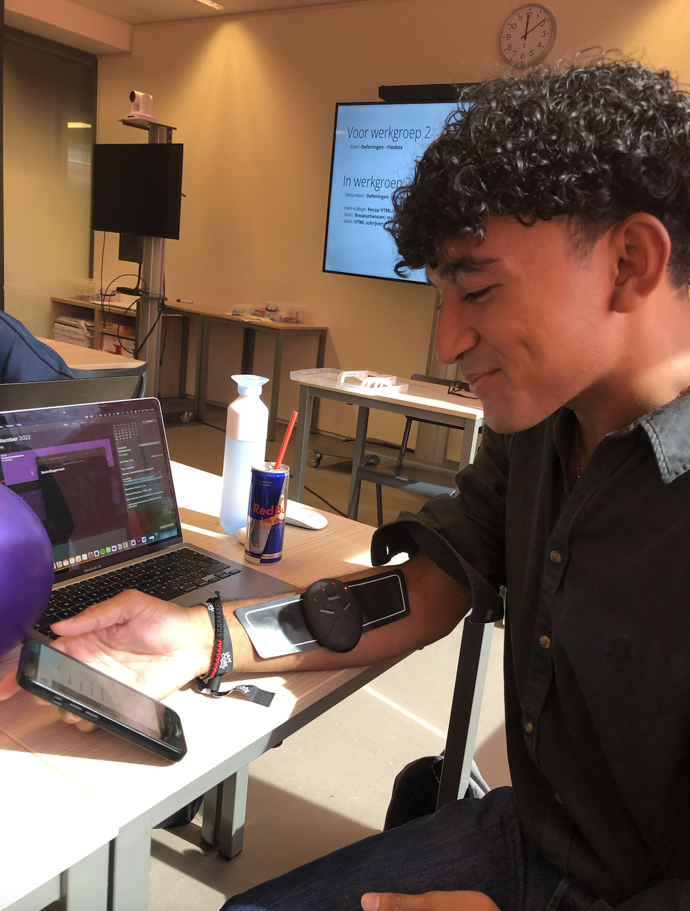
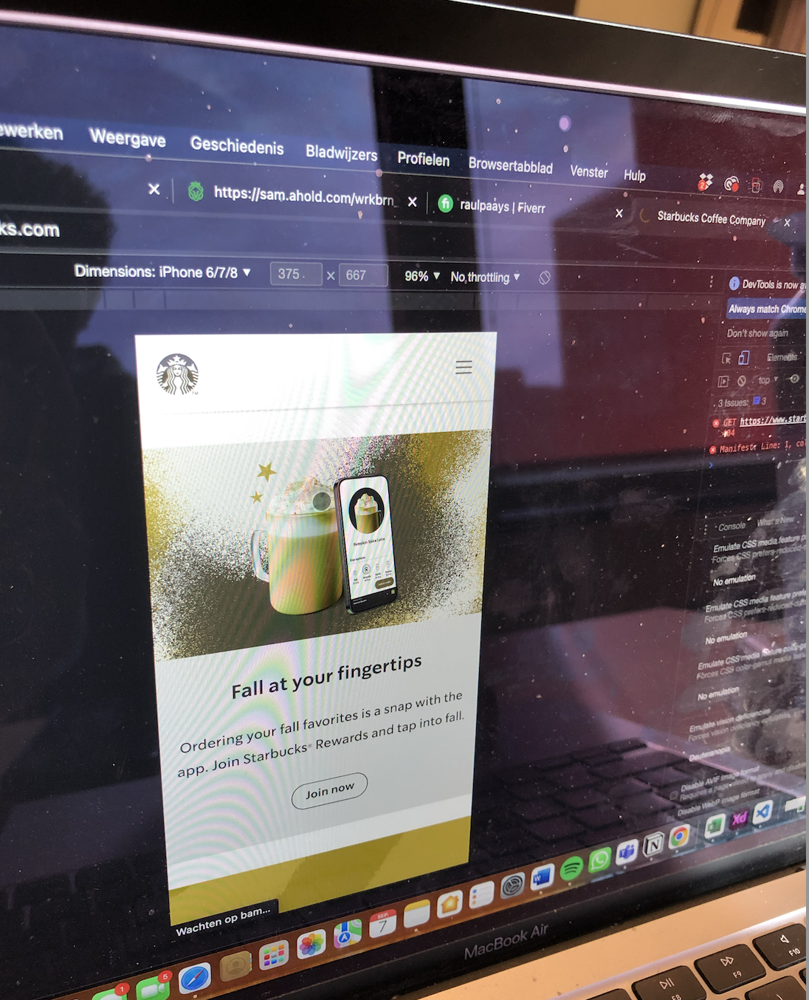
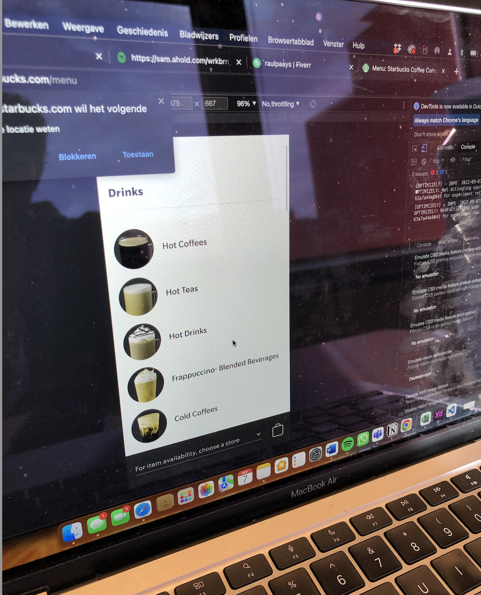
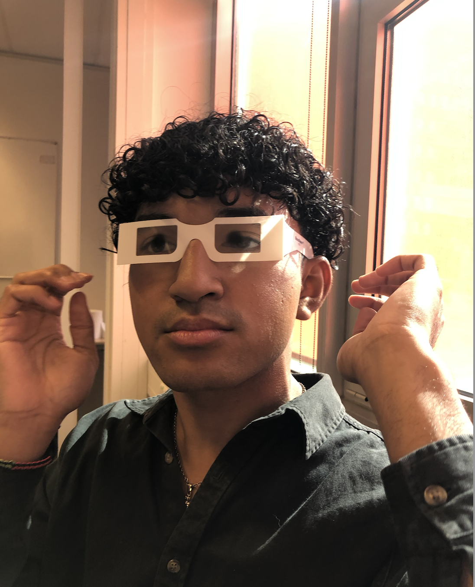

# Procesverslag
Markdown is een simpele manier om HTML te schrijven.  
Markdown cheat cheet: [Hulp bij het schrijven van Markdown](https://github.com/adam-p/markdown-here/wiki/Markdown-Cheatsheet).

Nb. De standaardstructuur en de spartaanse opmaak van de README.md zijn helemaal prima. Het gaat om de inhoud van je procesverslag. Besteedt de tijd voor pracht en praal aan je website.

Nb. Door *open* toe te voegen aan een *details* element kun je deze standaard open zetten. Fijn om dat steeds voor de relevante stuk(ken) te doen.

## Jij

  
uitwerken voor kick-off werkgroep

  ### Auteur:
  Katarina Živanović

  #### Je startniveau:
  Blauw

  #### Je focus:
  Ik vind het lastig om nu een keuze te maken. Het liefst wil ik ze beide in mijn website verwerken. (responsive & surface laag)
 

## Je website

  
uitwerken voor kick-off werkgroep

  ### Je opdracht:
  link naar de website die je gaat namaken óf de naam/omschrijving van je eigen ontwerp:
  https://www.starbucks.com/ 

  #### Screenshot(s) van de eerste pagina (small screen): 
  Home-pagina  
  

  #### Screenshot(s) van de tweede pagina (small screen):
  Menu 
  
 

## Toegankelijkheidstest 1/2 (week 1)

  
uitwerken na test in 1e werkgroep

  ### Bevindingen
  Lijst met je bevindingen die in de test naar voren kwamen:

  #### Screenreader
  Ik had als eerst een screenreader test afgenomen samen met Raul. M.b.v. een screenreader was hij door de Starbucks site gegaan. 

  

  

  Bevindingen:
  -Hij had moeite met swipen naar beneden.
  -Schuifbalk is verstopt, uiteindelijk kwam hij erachter dat je met drie vingers moet swipen.
  -Wordt niet goed aangegeven dat je via de logo naar home kan gaan. 

  Mogelijke oplossing:
  -Schuifbalk duidelijker aangeven. Misschien soort tips toevoegen.

  #### Muis en Toetsenbord 
  Daarna had ik samen met Raul de muis en toetsenbord test gedaan.

  Bevindingen:
  -Deze test was goed te doen op de Starbucks site.
  -Alles was goed te bedienen.
  -Hij had alles snel gevonden.

  Mogelijke oplossingen:
  -Geen, want alles was goed gegaan

  #### Motoriek (shocks, elastiekjes)
  Vervolgens had ik samen met Raul en Bener de ADHD test met een ballon gedaan. 

  

  

  Bevindingen Raul:
  -Kan prima de site besturen met een ballon.
  -Kon zich concentreren.

  Bevindingen Bener:
  -Hij kijkt de heletijd naar de ballon.
  -Kon zich niet zo goed concentreren.

  Mogelijke oplossingen:
  -Misschien gebruik maken van een one action per screen.

  Ik had ook de Spasmes test gedaan. Dit had ik ook samen met Raul en Bener gedaan.

  

   

  Bevindingen Bener:
  -Had het genoemde drankje gevonden.
  -Ookal trilde zijn hand, hij had het drankje (Pink drink) snel gevonden.

  Bevindingen Raul:
  -Kan zijn telefoon niet vasthouden, het valt steeds uit zijn handen.
  -Hij had het drankje (caramel frappucino) snel gevonden. 

  Mogelijke oplossingen:
  -Zou het niet weten. Want ze hadden hun drankje snel gevonden.

  #### Visueel (brillen, contrast, kleurenblind, dark/light). 
  Ten slot had ik een test gehouden met kleurtjes en verschillende soorten brillen. Raul en Bener hadden me hierbij geholpen.

  Bevindingen kleurtjes test Raul (kleurenblind):
  -Ziet er niet aantrekkelijk uit.
  -Het menu zier er bijvoorbeeld niet lekker uit.
  -Home pagina ziet er ook niet echt smakelijk uit. 

  

  

  Mogelijke oplossingen:
  -Andere kleurcontrast gebruiken.
  -Onderzoeken welke kleuren er goed uitzien voor kleurenblinden.

  Bevindingen bril Cataract Raul:
  -Moeilijk zichtbaar.
  -Ziet maar een paar woordjes.

  Mogelijke oplossingen:
  -Grotere woorden gebruiken.
  -Een goed kleurencontrast gebruiken, zodat het beter zichtbaar is.

  Bevindingen bril Central Field Loss Raul:
  -Moet schuin kijken, anders ziet hij het niet.

  

  Bevindingen bril Central Field Loss Bener:
  Home pagina:
  -Kan het prima lezen
  -Handig dat er grotere woorden zijn
  -Witte letters met donkere kleuren maakt het lezen makkelijker.
  -Bij sommige foto's ziet hij niet wat het precies is. Sommige foto's zijn te klein.
  -De onderste balk zag hij niet.

  Menu:
  -Kan de foto's prima zien.
  -Kan ook de tekst zien
  -De onderste balk zag hij niet.

  Mogelijke oplossingen:
  -Grotere afbeeldingen gebruiken.
  -Geen lichte kleuren gebruiken.

## Breakdownschets (week 1)

  
uitwerken na afloop 2e werkgroep

  ### de hele pagina: 
  

  ### dynamisch deel (bijv menu): 
  

  ### wellicht nog een dynamisch deel (bijv filter): 
  

## Voortgang 1 (week 2)

  
uitwerken voor 1e voortgang

  ### Stand van zaken
  hier dit ging goed & dit was lastig (neem ook screenshots op van delen van je website en code)

  ### Agenda voor meeting
  samen met je groepje opstellen

  | student 1      | student 2          | student 3    | student 4        |
  | ---            | ---                | ---          | ---              |
  | dit bespreken  | en dit             | en ik dit    | en dan ik dat    |
  | en dat ook nog | dit als er tijd is | nog een punt | dit wil ik zeker |
  | ...            | ...                | ...          | ...              |

  ### Verslag van meeting
  hier na afloop snel de uitkomsten van de meeting vastleggen

  - punt 1
  - punt 2
  - nog een punt
  - ...

## Voortgang 2 (week 3)

  
uitwerken voor 2e voortgang

  ### Stand van zaken
  hier dit ging goed & dit was lastig (neem ook screenshots op van delen van je website en code)

  ### Agenda voor meeting
  samen met je groepje opstellen

  | student 1      | student 2          | student 3    | student 4        |
  | ---            | ---                | ---          | ---              |
  | dit bespreken  | en dit             | en ik dit    | en dan ik dat    |
  | en dat ook nog | dit als er tijd is | nog een punt | dit wil ik zeker |
  | ...            | ...                | ...          | ...              |

  ### Verslag van meeting
  hier na afloop snel de uitkomsten van de meeting vastleggen

  - punt 1
  - punt 2
  - nog een punt
- ...

## Toegankelijkheidstest 2/2 (week 4)

  
uitwerken na test in 8e werkgroep

  ### Bevindingen
  Lijst met je bevindingen die in de test naar voren kwamen (geef ook aan wat er verbeterd is):

  #### Screenreader
  Hier korte omschrijving (met indien nodig afbeeldingen)

  Hier een omschrijving van hoe het opgelost kan worden (met indien nodig afbeeldingen)

  #### Muis en Toetsenbord 
  Hier korte omschrijving (met indien nodig afbeeldingen)

  Hier een omschrijving van hoe het opgelost kan worden (met indien nodig afbeeldingen)

  #### Motoriek (shocks, elastiekjes)
  Hier korte omschrijving (met indien nodig afbeeldingen)

  Hier een omschrijving van hoe het opgelost kan worden (met indien nodig afbeeldingen)

  #### Visueel (brillen, contrast, kleurenblind, dark/light). 
  Hier korte omschrijving (met indien nodig afbeeldingen)

  Hier een omschrijving van hoe het opgelost kan worden (met indien nodig afbeeldingen)

## Voortgang 3 (week 4)

  
uitwerken voor 3e voortgang

  ### Stand van zaken
  hier dit ging goed & dit was lastig (neem ook screenshots op van delen van je website en code)

  ### Agenda voor meeting
  samen met je groepje opstellen

  | student 1      | student 2          | student 3    | student 4        |
  | ---            | ---                | ---          | ---              |
  | dit bespreken  | en dit             | en ik dit    | en dan ik dat    |
  | en dat ook nog | dit als er tijd is | nog een punt | dit wil ik zeker |
  | ...            | ...                | ...          | ...              |

  ### Verslag van meeting
  hier na afloop snel de uitkomsten van de meeting vastleggen

  - punt 1
  - punt 2
  - nog een punt
  - ...

## Eindgesprek (week 5)

  
uitwerken voor eindgesprek

  ### Je uitkomst - karakteristiek screenshots:
  

  ### Dit ging goed/Heb ik geleerd: 
  Korte omschrijving met plaatjes

  

  ### Dit was lastig/Is niet gelukt:
  Korte omschrijving met plaatjes

  

## Bronnenlijst

  
continu bijhouden terwijl je werkt

  Nb. Wees specifiek ('css-tricks' als bron is bijv. niet specifiek genoeg).

  1. bron 1
  2. bron 2
  3. ...

